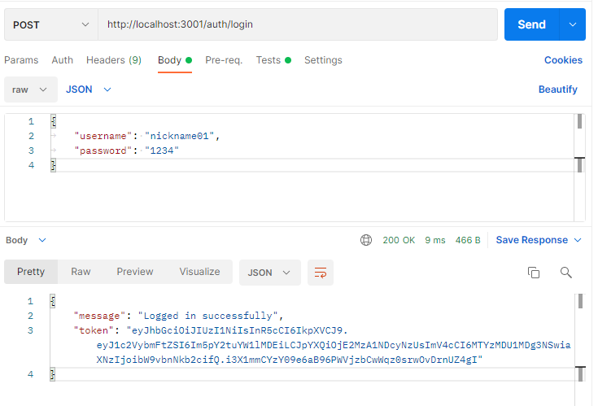
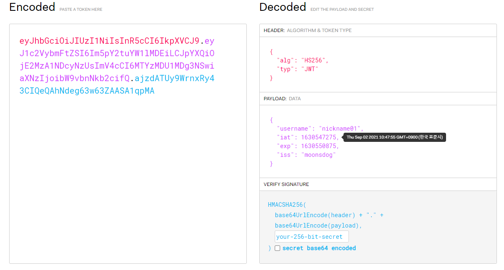

# JSON Web Token

JSON Web Token 튜토리얼 레파지토리 입니다.

예제 연습 코드와 학습 기록을 남기는데에 주 목적이 있습니다.

Velopert 님의 강의를 참고로 만듭니다.

[Express Server에서 JWT 구현하기](https://velopert.com/2448)

# 목차

- [JSON Web Token](#JSON-Web-Token)
  - [JWT 생김새](#JWT-생김새)
    - [Header](#Header)
    - [Payload](#Payload)
    - [Signature](#Signature)
- [프로젝트 생성 및 설정](#프로젝트-생성-및-설정)
- [라우터 설정](#라우터-설정)
- [User 객체 생성](#User-객체-생성)
  - [동기화 (Async/Await와 Promise)](<#동기화-(Async/Await와-Promise)>)
- [JWT 토큰 발급](#JWT-토큰-발급)
- [JWT 토큰 검증](#JWT-토큰-검증)

<br />

---

## JSON Web Token

JSON Web Token (이하: JWT)는 웹표준으로 두 개체에서 JSON 객체를 사용하여 가볍고 자가수용적인 방식으로 정보를 안전성 있게 전달해준다.

수 많은 프로그래밍 언어에서 지원되고, 자가 수용적이며 (모든 정보를 자체적으로 지니고 있음, 토큰의 기본정보, 전달할 정보, 토큰이 검증되었음을 증명하는 signature), 쉽게 전달할 수 있다 (HTTP 헤더에 넣어 전달할수도, URL의 파라미터로 전달할 수도 있음).

회원 인증, 즉 로그인 세션 유지와 같은 상황에서 가장 흔히 사용된다.

### JWT 생김새

`aaaaaa.bbbbbb.cccccc`

`a 파트`: 헤더(header) <br/>
`b 파트`: 내용(payload) <br/>
`c 파트`: 서명(signature) <br/>

<br/>

### Header

헤더는 2가지의 정보를 지니고 있다.

- typ: 토큰의 타입을 지정한다.
- alg: 해싱 알고리즘을 지정한다. 보통 `HMAC SHA256` 혹은 `RSA`가 사용되며, 토큰을 검증할 때 사용되는 signature 부분에서 사용된다.

ex)

```json
// 알고리즘으로 `HMAC SHA256` 을 사용한 예제
{
  "typ": "JWT",
  "alg": "HS256"
}
```

<br />

### Payload

정보(payload) 부분에는 토큰에 담을 정보가 들어있다. 여기서 정보의 한 조각을 `클레임(claim)` 이라고 부르며 key/value 와 같이 `name / value` 형식의 쌍으로 이루어져 있다. 이 부분에 여러 개의 클레임들을 넣을 수 있다.

클레임은 크게 세 분류로 나눌 수 있다.

- 등록된(`registered`) 클레임 <br/>
  토큰에 대한 정보를 담기 위해 이름이 이미 정해져 있는 클레임들. 이 것들을 사용하는 것은 모두 옵션이다. 아래와 같은 클레임들이 있다.
  - `iss` : 토큰 발급자
  - `sub` : 토큰 제목
  - `aud` : 토큰 대상자
  - `exp` : 토큰 만료시간
  - `nbf` : Not Before 를 의미하며, 토큰 활성 날짜와 비슷한 개념.
  - `iat` : 토큰이 발급된 시간.
  - `jti` : JWT의 고유 식별자. 중복 처리를 방지하기 위해 사용됨.
- 공개(`public`) 클레임
  충돌이 방지된 이름을 가지고 있어야 한다. 충돌을 방지하기 위해서는 클레임 이름을 URI 형식으로 짓는다.

```json
{
  "https://velopert.com/jwt_claims/is_admin": true
}
```

- 비공개(`priavted`) 클레임
  보통 양 측 (클라이언트 <-> 서버) 협의 하에 사용되는 클레임 이름들. 공개 클레임과 달리 이름이 중복되어 충돌이 될 수 있으니 사용할 때 유의해야 함.

```json
{
  "username": "moonsdog"
}
```

<br/>

### Signature

서명(signature) 부분에는 헤더의 인코딩값과 정보의 인코딩값을 합친 후 주어진 비밀키로 해쉬를 하여 생성한다.

예를 들어 헤더를 인코딩한 값이 `aaaaaa` 이고 정보를 인코딩한 값이 `bbbbbb` 이라하면 `aaaaaa.bbbbbb`를 `secret`으로 해싱을 하고 `base64 인코딩`한 결과값이 서명 부분이다.

<br/>

## 프로젝트 생성 및 설정

express generator 를 이용하여 간단하게 express 환경을 구축.

```
$ express jwt-tutorial --view=pug
```

아래와 같은 모듈을 추가 설치한다

- jsonwebtoken : 이 프로젝트의 핵심 모듈. JWT를 손쉽게 생성하고 검증까지 해줌.
- mysql : 이 서버에서 MySQL 를 사용할 수 있게 해줌.

```
$ npm install jsonwebtoken
$ npm install mysql
```

## 라우터 설정

우선 간단하게 하나의 라우터에서 2개의 쿼리를 처리하도록 한다.

- `/auth/login` : 로그인 요청 처리
  POST형식으로 `{ username, password }` 를 전달받아서 username에 해당하는 password가 일치하는지 확인.
- `/auth/register` : 회원가입 요청 처리
  POST형식으로 `{ username, password }` 를 전달받아 username 이 중복되는지 확인한 후 데이터베이스에 새로운 레코드를 생성한다.

## User 객체 생성

위 라우터 설정에서 기술했던 처리 방식을 구현하기 위한 코드를 모두 라우터에 다 때려박으면 가독성이 매우 심하게 떨어지고 재사용하기 어려울 것이라 생각해서 `User` 라는 객체를 생성하여 Controller 들을 관리하려 한다.

지금까지 필요한 기능은 3개로 `password 확인`, `username 중복확인`, `새로운 유저 정보 생성`이다.

### 동기화 (Async/Await와 Promise)

또한 후에 토큰 발급과 관련된 기능 등이 추가되고 로그인 과정이 복잡해지면 동기화 과정에서 끔찍한 경험을 하게 될 것이기 때문에 미리 미리 `async/await` 문법을 이용하여 동기화를 해둔다.

어쨌든 User 객체의 구현은 아래와 같이 한다. 각 쿼리마다 동기화를 적용한 간단한 코드이다.

```javascript
const mysql = require("mysql");
const dbconfig = require("../dbconfig");
const conn = mysql.createConnection(dbconfig);

const User = {
  create: (username, password) => {
    return new Promise((resolve, reject) => {
      conn.query(
        "INSERT INTO user (username, password) VALUES (?, ?);",
        [username, password],
        (err) => {
          if (err) reject(err);
          else {
            resolve();
          }
        }
      );
    });
  },
  verify: (username, password) => {
    return new Promise(function (resolve, reject) {
      conn.query(
        "SELECT password FROM user WHERE username=?",
        [username],
        (err, result) => {
          if (err) reject(err);
          else {
            if (result[0].password === password) resolve();
            else reject("WRONG PASSWORD");
          }
        }
      );
    });
  },
  findOneByUsername: (username) => {
    return new Promise((resolve, reject) => {
      conn.query(
        "SELECT COUNT(*) AS length FROM user WHERE username=?",
        [username],
        (err, result) => {
          if (err) reject(err);
          else {
            if (result[0].length !== 0) reject("INVALID USERNAME");
            else resolve();
          }
        }
      );
    });
  },
};

module.exports = User;
```

이에 맞춰 라우터도 아래와 같이 구현하였다.

```javascript
const express = require("express");
const mysql = require("mysql");
const router = express.Router();
const url = require("url");
const dbConfig = require("../dbconfig");
const User = require("../models/user");

router.post("/login", async (req, res) => {
  const { username, password } = req.body;
  try {
    const result = await User.verify(username, password);
    res.send(result);
  } catch (err) {
    res.send(err);
  }
});

router.post("/register", async (req, res) => {
  const { username, password } = req.body;
  try {
    await User.findOneByUsername(username);
    await User.create(username, password);

    res.send("REGISTED!");
  } catch (error) {
    res.send(error);
  }
});

module.exports = router;
```

<br/>

## JWT 토큰 발급

라우터 동작 확인 및 동기화가 잘 되었음을 확인하였으니, 이제 제대로 된 로그인 API 기능을 구현한다.

로그인 유지의 흐름은 아래와 사진과 같으며 지금부터 하나씩 구현해보도록 한다.


위 그림의 3번부터 시작해본다.

`jwt.sign(payload, secret, options, [callback])` 함수를 사용하여 토큰을 발급 받을 것이며, 이 함수에 대한 자세한 설명은 아래와 같다.

- `callback` 이 전달되면 비동기적으로 작동하며, 인자는 `(err, token)` 이다. 전달되지 않으면 동기적으로 작동하며, JWT 를 문자열 형태로 리턴한다.
- `payload` 는 객체, buffer, 문자열 형태로 전달 가능하다.
- `secret` 은 서명을 만들 때 사용되는 알고리즘에서 사용하는 문자열 혹은 buffer 형태의 값이다.
- `options`:
  - `algorithm`: default- `HS256`
  - `expiresIn`: 예) 60, `2 days`, `10h`, `30m` ...
  - `notbefore`: expiresIn 과 같은 형태
  - 등등 자세한 건 필요할 때 찾아보자..

위 내용을 바탕으로 JWT에 대한 메서드들을 정의하는 `JWTController` 를 생성한다. 그리고 발급하는 메서드를 작성한다.

```javascript
const jwt = require("jsonwebtoken");
const secretKey = require("../key/jwtconfig");

const JWTController = {
  generate: (payload) => {
    const secret = secretKey.secret;
    const option = secretKey.option;
    return new Promise((resolve, reject) => {
      jwt.sign(payload, secret, option, (err, token) => {
        console.log(token);
        if (err) reject(err);
        resolve(token);
      });
    });
  },
};

module.exports = JWTController;
```

콜백 함수를 지정하면 비동기적으로 작동하므로 Promise 함수를 반환하게 하여 동기적으로 작동하게끔 한다.

이제 라우터에서 로그인 요청이 들어올 시에 아이디/비밀번호가 맞는지 확인한 후 맞으면 토큰을 발급하도록 하자.

```javascript
// (....)
router.post("/login", async (req, res) => {
  const { username, password } = req.body;
  try {
    await User.verify(username, password);
    const token = await JWTController.generate({ username });
    res.send({
      message: "Logged in successfully",
      token,
    });
  } catch (err) {
    res.send(err);
  }
});
// (....)
```

- 결과



잘 나온다.

[jwt.io](jwt.io) 에서 디코딩도 한 번 테스트 해보자.



전달했던 `payload.username` 이었던 `nickname01` 이 나타난다.

<br/>

## JWT 토큰 검증

token을 get 방식으로 받아서 유효한 token 인지 확인해보도록 한다. 위에서 생성했던 `JWTController` 에 `verify(token)` 메서드를 추가해준다.

```javascript
// (...)
verify: (token) => {
    return new Promise((resolve, reject) => {
      if (!token) reject("not logged in");
      jwt.verify(token, secret, (err, decoded) => {
        if (err) reject("verify error");
        resolve(decoded);
      });
    });
  },
```

- 토큰이 없다면 로그인을 하도록 메시지를 보낸다.
- 유효하지 않은 토큰이면 해당 메시지를 보낸다.

그에 해당하는 쿼리를 `/check` 이라 하고 라우터에 정의해준다.

```javascript
// (...)
router.get("/check", async (req, res) => {
  const _url = req.url;
  const queryData = url.parse(_url, true).query;
  const token = queryData.token;
  console.log(token);
  try {
    const decoded = await JWTController.verify(token);
    res.send({
      message: "Valid token",
      token,
      decoded,
    });
  } catch (err) {
    res.send(err);
  }
});
```

<br/>

유효한 토큰을 넣었을 때의 결과 모습

![verify 성공][./images/token_verify.png]

유효하지 않은 토큰을 넣었을 때의 결과 모습


토큰을 넣지 않았을 때 (로그인 한 기록이 없을 때)의 결과 모습


<br/>
